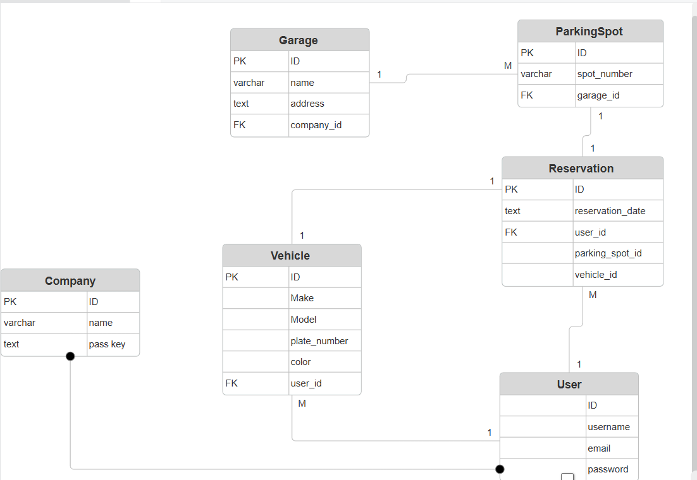

# slotify-backend

##  Project Description
Slotify is a parking reservation system that allows users to create an account, browse available garages, reserve parking spots, and manage their vehicles and reservations.

---

##  Repository Description
This backend handles:
- User authentication (signup/login)
- Managing garages and parking spots
- Managing user vehicles
- Managing reservations

---

## Tech Stack
- Python
- Django
- PostgreSQL
- Docker 

---

## Front End Repo Link

(https://github.com/Rana370/slotify-frontend)

---

## 🗺️ ERD Diagram

## Routing Table

Method          URL                     Purpose
POST        /user/signup/                   Create new user account
POST        /user/login/                    Log in existing user
GET         /dashboard/                     List all garages
GET         /garage/:garage_id/             List all parking spots in selected garage
POST        /parking_spot/:id/reservation/  Create a new reservation
GET         /reservations/                  View my reservations
PUT         /reservations/:id/              Update my reservation
DELETE      /reservation/:id/               Cancel my reservation
GET         /vehicle/                       View my vehicle(s)
PUT         /vehicle/:id/                   Update my vehicle
DELETE      /vehicle/:id/                   Delete my vehicle

## IceBox Features
